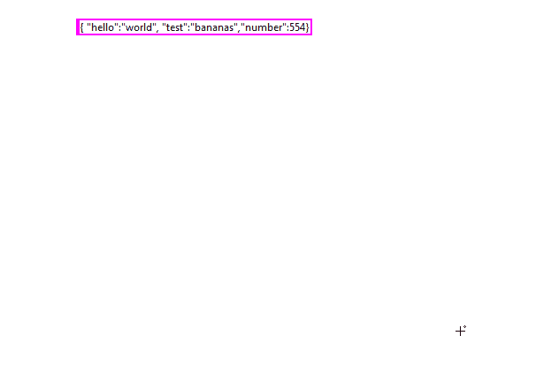

# QuickDrop-Format-JSON
Labview Quickdrop Plug-in to format JSON strings into readable text.

Select a string constant or string control and activate the plug-in via QuickDrop (`CTLR+Space`) and the default shortcut `CTRL+F`.

#### Acknowledgements

The plug-in just wraps the "Pretty Print.vi" from the JSONtext library. All credits go to Dr. James Powell for his awesome work.

#### Development:

Dependencies: [JSONtext >=1.9.0.124](https://bitbucket.org/drjdpowell/jsontext/src/master/)

